# Memory Mayhem

## Purpose of the Project

**Description:**

Welcome to Memory Mayhem, a thrilling web-based memory game that challenges your cognitive skills and sharpens your memory prowess!
Memory Mayhem is designed to provide an entertaining and stimulating experience while enhancing memory retention and cognitive abilities. The game aims to:

**Exercise Your Memory:** 

Engage in a fun-filled gameplay experience that requires remembering patterns, sequences, and placements.

**Boost Cognitive Skills:** 

Sharpen your concentration, attention to detail, and overall cognitive abilities through interactive gameplay.

**Entertainment and Enjoyment:** 

Delve into an immersive world of squares and challenges, offering a delightful break from routine while keeping your mind engaged.

### Why This Project:

Creating Memory Mayhem offers the chance to provide an engaging, enjoyable way for people to enhance their memory skills while having fun, ultimately aiming to offer a playful yet impactful tool for cognitive improvement.

### Project Objectives:

- *Enhance Memory Skills:* Develop a game that effectively challenges and improves users' memory retention, recall, and cognitive abilities through engaging gameplay.

- *User Engagement:* Create an immersive and captivating gaming experience to ensure high user engagement, encouraging frequent revisits and extended play sessions.

- *Scalable Difficulty Levels:* Implement a system with scalable difficulty levels to accommodate players of varying skill levels, providing both newcomers and experienced users with a challenging yet enjoyable experience.

- *Technologically Inclusie:* Make the website scalable and supported across all browsers and screen widths.

- *Comprehensively Tested:* Create a structurally rigid website prone to no bugs or issues.
  
## User Stories

### Current User Stories:

1. **As a new player:** I want instructions that guide me through the game mechanics, explaining how to play and offering tips for improving my memory skills.

2. **As an experienced player:** I want challenging levels that push my memory abilities further, keeping the game engaging even as I improve.

3. **As a player on the go:** I want the game to be accessible on multiple devices, allowing me to play during transit or regardless of the platform i'm using.

4. **As a player concerned about my learning curve:** I want the difficulty to gradually increase as I progress through levels, allowing me to adapt and improve without feeling overwhelmed.

5. **As a parent:** I want the game and website to be easily understandable in order to allow my children to play, I would also expect it to have family-freindly content.

### Future User Stories:

1. **As a competitive user:** I want the ability to see high scores or compete against friends on a leaderboard to add a social element to the game.

2. **As a user with limited time:** I want the option to save my progress mid-game, enabling me to continue from where I left off in a later session.

3. **As a user with specific preferences:** I want the option to choose from various themes and square designs to personalize my gaming experience.

## Features

### Key Features:

- **Navigation:** Easy-to-use navigation for seamless user experience whilst orientating the website. This feature displays the navigation links, taking you to each individual section of the website.

- **Home Section:** An introduction to the website which includes two informative sections and a animated cartoon brain. One of these sections decribes the cognitive benefits of memroy games whilst the other informs the users about Memory Mayhem.

- **Game Section:** Showcases the game display which includes a score and live counters. At the bottom of the display you will find a well-placed vibrant green button, which when pressed will start Memory Mayhem. Gameplay is **INFINITE!**
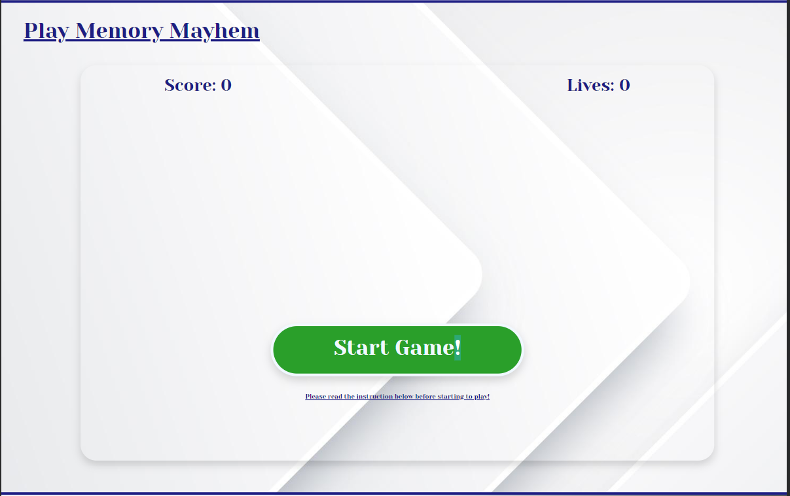
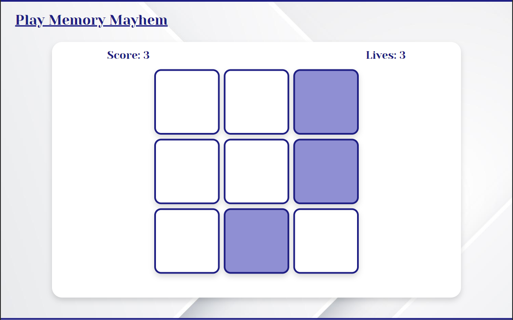
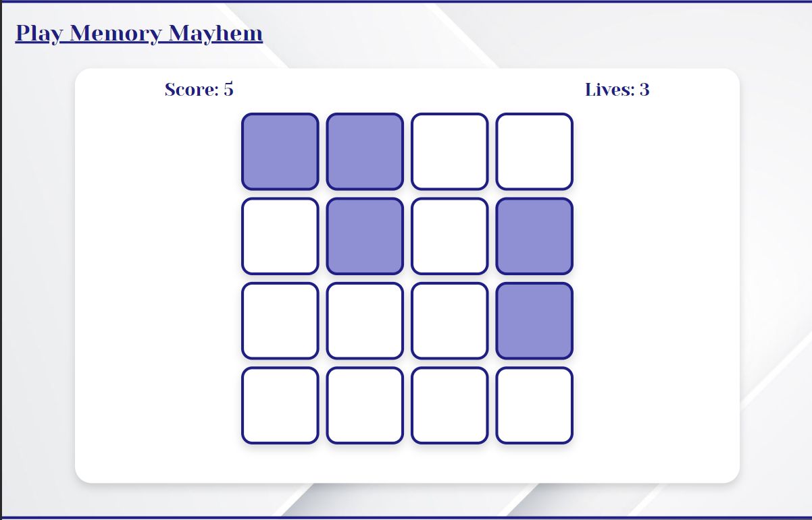
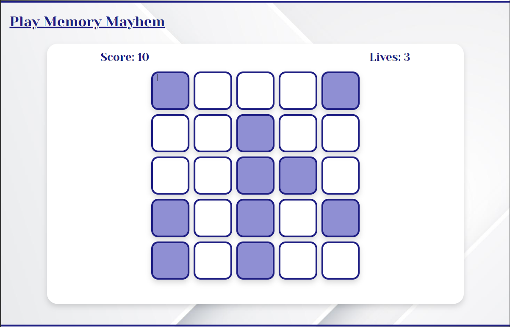

- **Instructions Section:** Information on how to play, scoring, accesing the game and more. On the left handside, an animated question mark rolls in when refreshed.
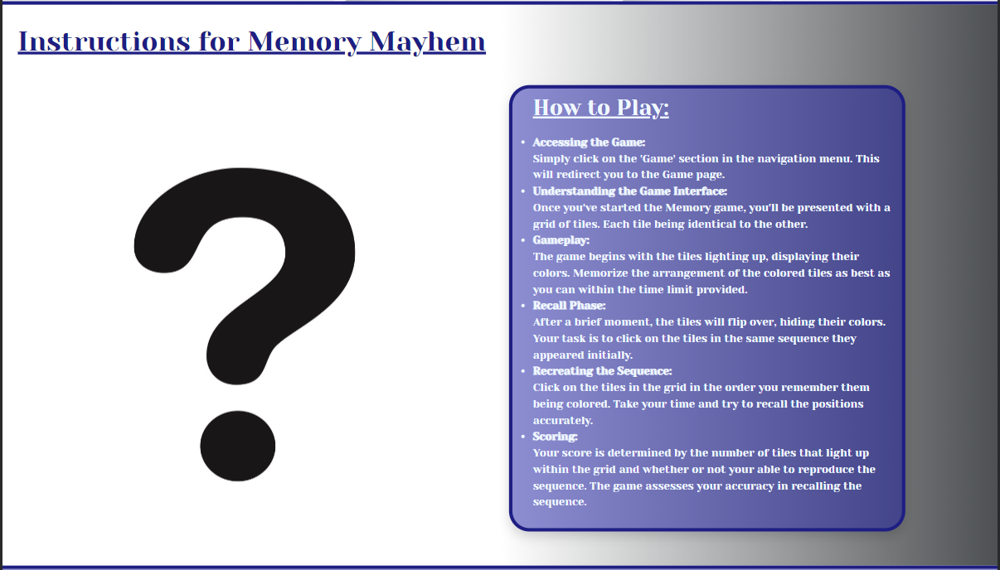

- Footer Section: In the footer users can find copyright information and contact details.

## Future Features

### Planned Future Features:

- Implement a user registration and login system.
- Develop a leaderboards page so users can compare highscores.
- Include a high-score counter, which tracks your all time high-score.

## User Experience Design Features

### Intuitive Scroll:

- Each page is designed to end slightly before the end of the browsers viewing height. This is done so that the following page's heading is visible from the previous page. This entices users to keep scrolling down and view the following pages. It also disproves the misconception that the website finishes there. I have implemented this for all the supported devices.

### Typography:

- **Primary Font:** *Yeseva One*, often conveys a sense of elegance and sophistication, making it suitable for designs requiring a touch of class or refinement. Its graceful curves and proportions can add a sense of style to headings or titles.

- **Secondary Font:** *Sans-Serif*, I chose my secondary font as sans-serif as its the basic font built across all browsers and supported everywhere. If by some reason my main font doesn't load I can always rely and depend on sans-serif.

### Color Scheme:

- **Primary Color:** *#8f8fd3* is a soft and muted shade of lavender. This color tends to evoke a sense of calmness, tranquility, and relaxation. It can be suitable for creating a serene and peaceful user experience, perfect for it's compatability with a memory game.
  
- **Secondary Color:** *#1e1e83* is a deep navy blue. Against lighter backgrounds, this color provides strong contrast, making text or elements placed on it more readable. It can be useful for highlighting important information or creating emphasis.

## Wireframes

### Wireframes:

- **Home Section Wireframe:** 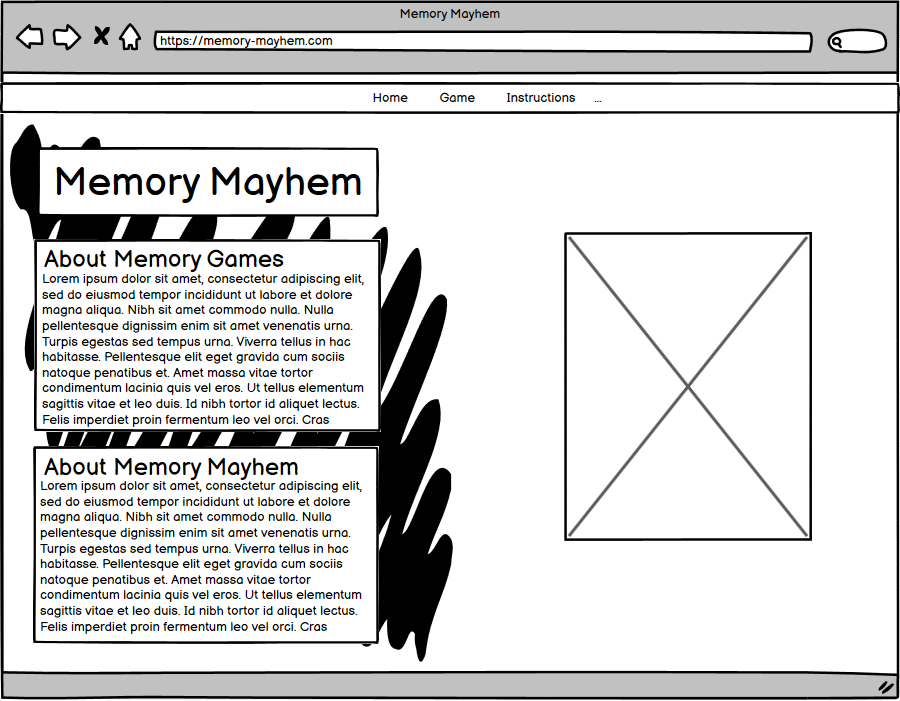

- **Game Section Wireframe:** 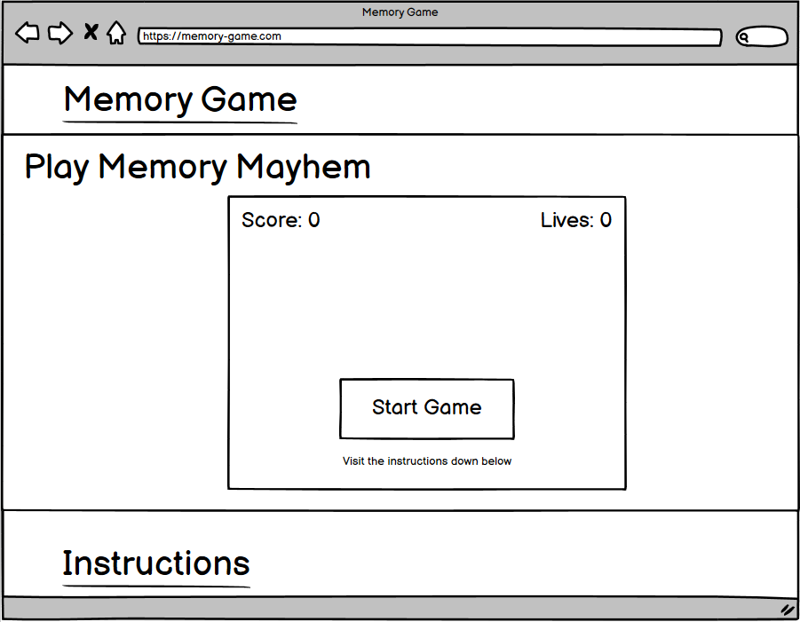

- **Instructions Section Wireframe:** 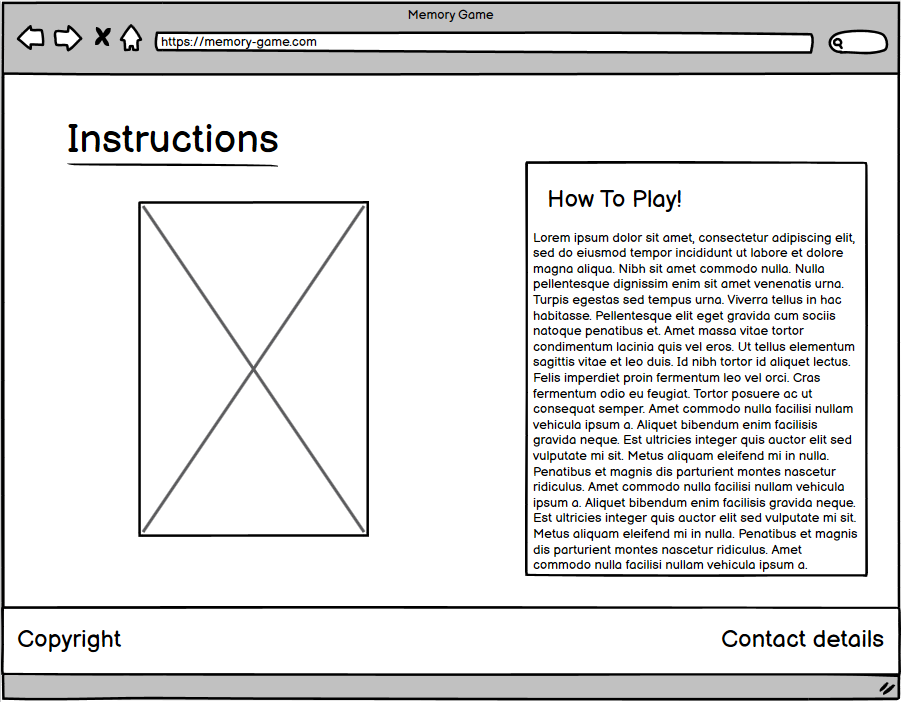

## Technologies

### Languages:

- **HTML:** Used to structure the contents for my website.
- **CSS:** Used to style the content of my website.
- **JavaScript:** Used to add the interactivity to the website.

**Frameworks and Add-Ons:**

- **Jquery:** Used to make manipulating the DOM easier.
- **Jest:** Used to mock and test my javascript code.
- **Bootstrap:** Used to make the website scalable across multiple screen sizes.
- **Google Fonts:** Used to apply non-included fonts onto my text.

**Additional:**

- **GitPod:** My Integrated Development Environment.
- **Git and Github:** Used Git for source code management and github for version control.
- **GitPages:** For deployment of my website.

## Testing

### W3C Validator:

- ***HTML*** 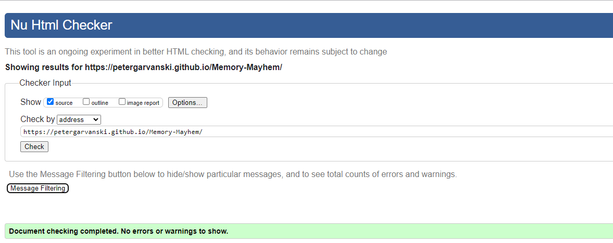

### Jigsaw Validator:
- ***CSS*** 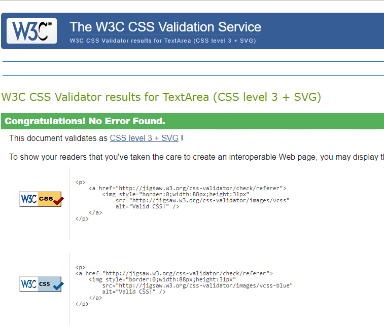

### Jest Mocking and Unit Tests:
- ***JavaScript*** 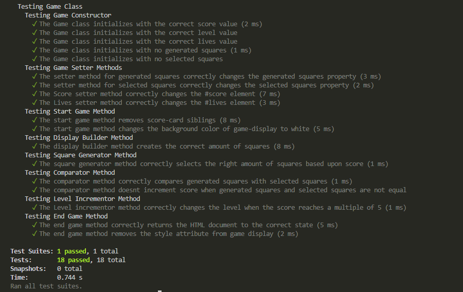

### Manual Testing:

| Feature                 | Action                             | Expected Result               | Tested | Passed  | Comments            |
| ----------------------- | ---------------------------------- | ----------------------------- | ------ | ------- | ------------------- |
| Home Navigation         | Click on the 'Home' link           | Redirect to Home page         | ✅     | ✅     | Works Fine          |
| Game Navigation         | Click on the 'Game' link           | Redirect to Game page         | ✅     | ✅     | Works Fine          |
| Instructions Naviation  | Click on the 'Instructions' link   | Redirect to Instructions page | ✅     | ✅     | Works Fine          |
| Brain Animation         | Check Home page to see             | Brain Should be spinning      | ✅     | ✅     | Works Fine          |
| Question-Mark Animation | Refresh the page to see            | Question-Mark should roll in  | ✅     | ✅     | Works Fine          |
| Start Button            | Click on 'Start Game' button       | Should start the game         | ✅     | ✅     | Works Fine          |
| Score Counter           | Pass a Level to see incrementation | Should Increase by one        | ✅     | ✅     | Works Fine          |
| Lives Counter           | Click a wrong square               | Should Decrease by one        | ✅     | ✅     | Needs 1 more press  |
| Right-Square Clicked    | Click the right square             | Should turn square purple     | ✅     | ✅     | Works Fine          |
| Wrong-Square Clicked    | Click the wrong square             | Should turn square grey       | ✅     | ✅     | Works Fine          |

### Fixed Bugs:

1. **Negativve Lives Bug:** My Lives counter would go negative. After thorough testing I discovered this was due because within my ***playerTurn()*** Method, the conditional else if statement was checking the ***wrongSquares.length*** but this would change with every incrementation of a new level. To fix this, I simply used the ***Lives*** class property and compared to see if it was ***>= 0***.

2. **Too Many Generated Squares Bug:** This bug happened ater the first level was surpassed. The ***generateSquares()*** method would generate too much squares. I realised this was because the ***generatedSquares*** property wasn't getting reset. To fix this, I simply added the ***setGeneratedSquares([])*** within the ***gameSequence()*** function, before the ***generateSquares()*** method.

### Supported Screen Sizes:

- **For Small, Medium and Large Phone Screen Sizes:** (Breakpoint: 320px to 576px).
- **For Small and Medium Tablet Sizes:** (576px to 768px).
- **For Small and Medium Laptop Screen Sizes:** (768px to 992px).
- **For Large Laptop and Small Desktop Screen Sizes:** (992px to 1200px).
- **For Large Desktop Screen Sizes:** (1200px +).

## Deployment

The Site was Deployed on GitHub Pages. This is the link <https://petergarvanski.github.io/Memory-Mayhem/>